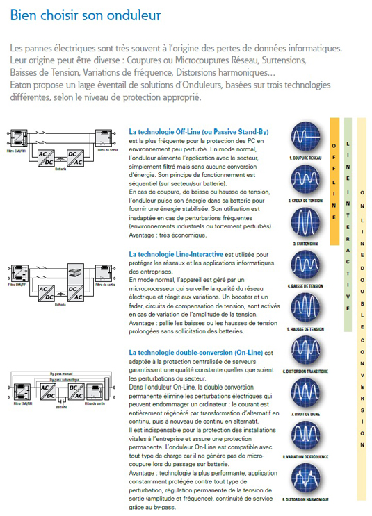

# [Onduleur](readme.md)

## Description

UPS : Uninterruptible Power Supply

## Type d'onduleurs

## Notion de puissance

Le choix de l'onduleur le mieux adapté va avoir comme premier critère la consommation du matériel qu'il va devoir suppléer en cas de panne. Pour se faire, il est essentiel d'avoir quelques notions sur la puissance de consommation et son calcul.
La puissance d'un onduleur est exprimée en V.A., ou Volts Ampères. Avant de choisir un onduleur, il faut faire la somme de la consommation de tous les appareils que l'on va lui connecter.
Le problème c'est qu'en général sur le matériel informatique, la consommation est exprimée en Watts. Pour convertir rapidement des Watts en V.A., on peut utiliser cette formule approximative :  
> Nombre VA = Nombre de Watts /0.66

Pour vous faciliter la tâche, voici quelque Valeurs communes pour matériels informatiques :

    Pour 1 PC Classique : 200 Watt de consommation soit 300 VA de puissance
    Pour 1 PC Serveur : 250 Watt de consommation soit 350 VA de puissance
    Pour 1 Ecran standard : 90 Watt de consommation soit 150 VA de puissance

Vous l'aurez compris, il est donc essentiel de calculer la consommation total des appareils que vous voulez connecter à l'onduleur et sa puissance en VA correspondante. Il vous sera ainsi plus facile da choisir entre les différents modèles et surtout cela vous évitera de vous retrouver avec un onduleur inefficace.

## Défaillance électrique et solution

Il est souvent pratique de savoir contre quel type de défaillance électrique on peut se prémunir et de quel façon l'onduleur solutionne le problème. Ainsi le choix de l'onduleur sera plus facile et plus précis.

* **Les Chutes de tension :** Pour se premunir contre les chutes de tensions les Onduleurs LINE-INTERACTIVE ou ON-LINE sont efficaces. Ils vont offrir une régulation automatique de voltage (AVR). Plus concrètement, l'onduleur va remonter la tension jusqu'à la tension nominale, soit 230 V (Boost).

* **Les Surtensions :** Pour solutionner les problème de surtension, les onduleurs LINE-INTERACTIVE ou ON-LINE sont efficaces. Ils vont aussi permettre la régulation automatique de voltage (AVR). Cette fois l'onduleur va abaisser la tension jusqu'à la tension nominale, soit 230 V (Buck).

* **Les Coupures :** Les onduleurs LINE-INTERACTIVE ou ON-LINE régleront les problème de coupures en palliant l'absence de courant du réseau. Plus simplement les appareils connectés seront alimentés par les batteries de l'onduleur.

* **Les Pics :** Les onduleurs LINE-INTERACTIVE ou ON-LINE règlent ce type de problème par la régulation automatique de voltage (AVR) / Parafoudre. Plus simplement l'onduleur lisse la courbe de tension de sortie en supprimant les pics de tension.

* **Les Bruits :** Les onduleurs LINE-INTERACTIVE ou ON-LINE vont permettre un filtrage des interférences électromagnétiques (EMI) et radio (RFI).

* **Les Distorsions :** Seule les onduleurs ON-LINE sont capables de solutionner ce type de problème reformant la sinusoïdale de la tension. Le courant ainsi produit est filtré en permanence.

L'ensemble de ces défaillances sont pris en charges par les onduleurs ce qui permet d'obtenir une protection optimale.

## Type d'utilisation

Le critère essentiel pour le meilleur choix d'un onduleur reste sans nul doute le type d'activité que vous effectuer. De ce fait nous avons classer les 3 catégories d'onduleurs en fonction de leur mode d'utilisation de ce fait il vous sera facile de trouver l'onduleur le mieux approprier :

* **Les onduleurs OFF-LINE :** La technologie basique et le temps de commutation trop long réduisent le champs d'utilisation de ce type d'onduleur. Ainsi ils seront recommandés pour les activités bureautiques basiques.

* **Les onduleurs LINE-INTERACTIVE (Line Interactive) :** Son pilotage par micro processeur, son temps de commutation court et sa grande polyvalence rendent ce type d'onduleurs compatible avec les activités suivantes : Environnements électriques urbains, applications bureautiques, jeux et activités multimédia, périphériques (fax, imprimantes, scanner, modem...).

* **Les onduleurs ON-LINE :** Son système de reconstitution permanant du courant combiné à n temps de commutation nul pour un signal pur et régulé rend ce type d'onduleur compatible avec les applications suivantes : Tout environnement électrique même très perturbé, tous systèmes électroniques sensibles, gros serveurs informatiques, serveurs et applications de gestion, applications industrielles.

## Sources

* [Onduleur](http://www.mononduleur.fr/content/10-calcul-de-puissance)
* [Onduleur](https://www.exertis-connect.fr/guide-onduleur)