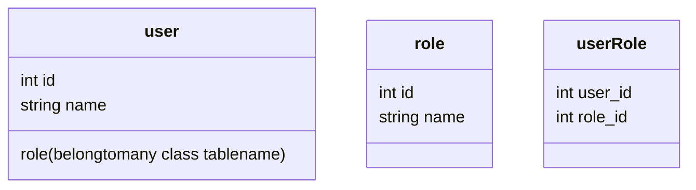

# [Relations](readme.md)

## Many to many

```mermaid
classDiagram

class user{
    int id
    string name
    role(belongtomany class tablename)
}

class role{
    int id
    string name
}

class userRole{
    int user_id
    int role_id
}


```
