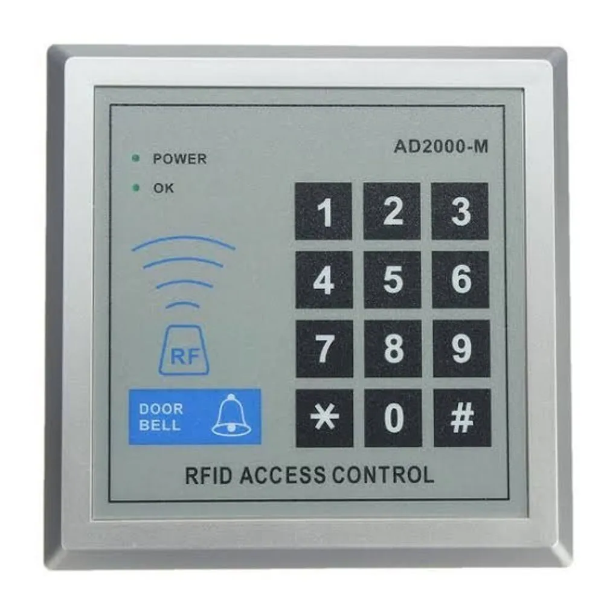

# [Controle d'accès](readme.md)

## Description

C'est un lecteur de contrôle d'accès autonome générique.  
Il peut prendre plusieurs codes et un seul code utilisateur.

## Codes par défaut

| Code | Utilisateur |
|:--|:--|
| 8888 | Utilisateur |
| 12345 | Technicien |

## Ajouter une carte

`* + code_tech + 1 + carte + 001 + # + *`

## Supprimer toutes les cartes

`* + code_tech + 2 + 0000 + #`

## Modifier le code utilisateur

`* + code_tech + 5 + code + # + code + #`

## Modifier le code technique

`* + code_tech + 5 + code + # + code + #`

## Sources

* 