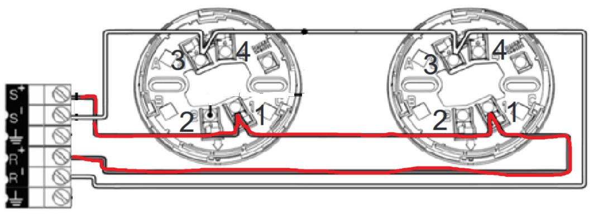

# [Detnov](readme.md)

## Codes

| Niveau | Code |
| :-- | :-- |
| Utilisateur | 1111 |
| installateur | 2222 |

## Mise en service

### Détecteurs

Avant de poser les détecteurs il faut les adresser avec la centrale.  
Pour programmer un détecteur il faut connecteur un appareil sur la boucle puis faire :

1. ok (Entrer dans le menu)
2. 2222 (Saisir le code utilisateur)
3. bas bas (choisir le menu éléments)
4. ok (valider)
5. bas (Selectionenr la programmation des LED)
6. ok (valider)

### Connexion

## Sources

* 