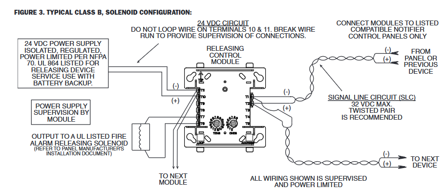
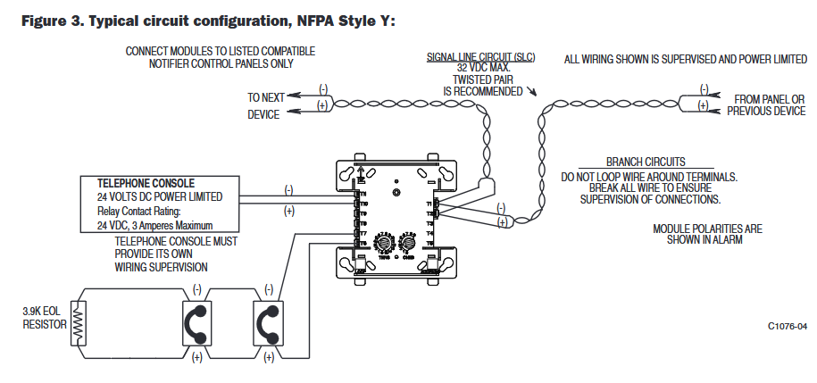
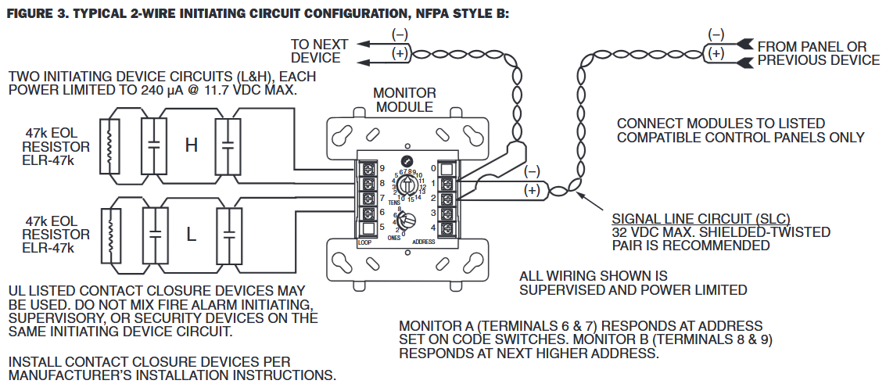
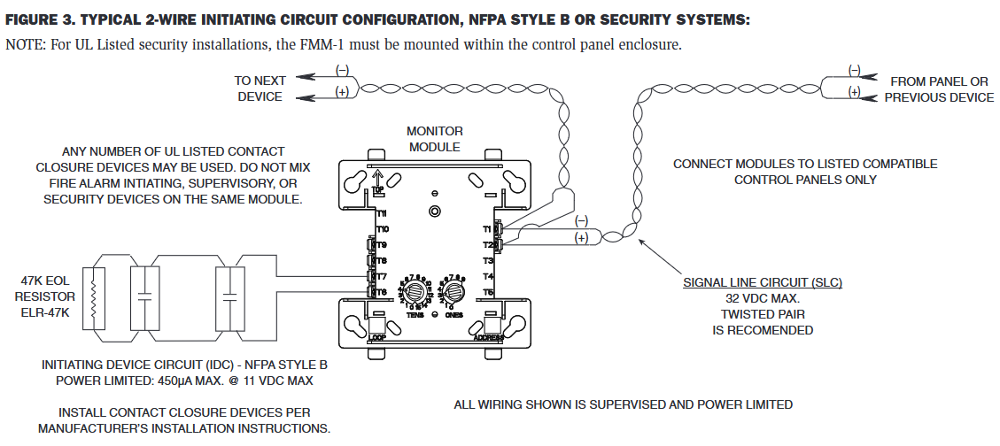
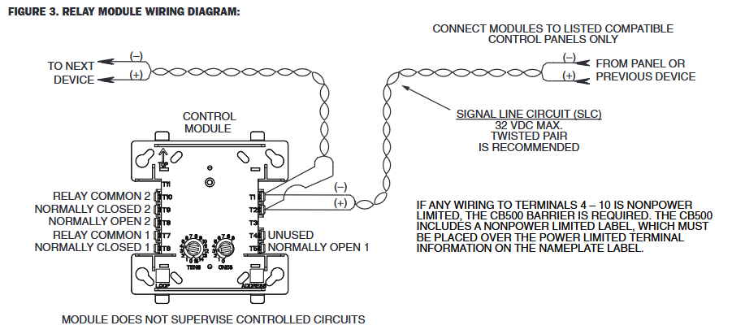

# [Modules](readme.md)

## FCM (Control Module)

* Module de commande 24V supervisé
* Résistance de 47K

## FTM (Firephone Control Module)

* Module de commande 24V supervisé
* Résistance de 3.9K

## FDM (Dual Monitor Module)

* Module 2 entrées de supervision
* Résistance de 47K

## FMM ( Monitor Module)

* Module 1 entrée de supervision
* Résistance de 47K

## FRM (Relay Module)

* Module 2 sorties relais

