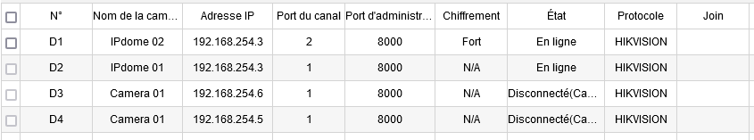
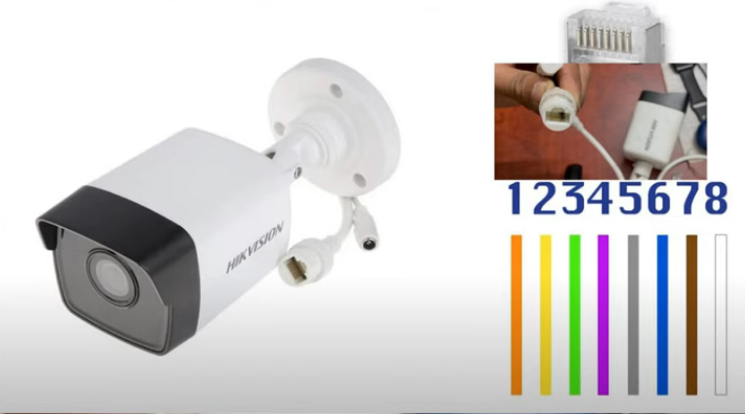

# [HIKVISION](readme.md)

## Description

## RTSP Protocol

> rtsp://192.168.1.64/Streaming/channels/101

## Vidéo tandem ou fisheye

Pour configurer une caméra qui a plusieurs vues il faut configurer la caméras sur plusieurs ports avec la même adresse en changeant le numéro de port.

## Réparer un connecteur endommagé

## Sources

* 